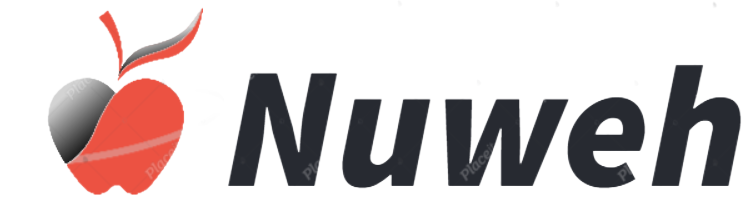

# My-portfolio <a name="readme-top"></a>

<!--
HOW TO USE:
This is an example of how you may give instructions on setting up your project locally.

Modify this file to match your project and remove sections that don't apply.

REQUIRED SECTIONS:
- Table of Contents
- About the Project
  - Built With
  - Live Demo
- Getting Started
- Authors
- Future Features
- Contributing
- Show your support
- Acknowledgements
- License

OPTIONAL SECTIONS:
- FAQ

After you're finished please remove all the comments and instructions!
-->

<div align="center">
  <!-- You are encouraged to replace this logo with your own! Otherwise you can also remove it. -->
  
  <br/>

  <h3><b>Microverse README Template</b></h3>

</div>

<!-- TABLE OF CONTENTS -->

# 📗 Table of Contents

- [📖 About the Project](#about-project)
  - [🛠 Built With](#built-with)
    - [Tech Stack](#tech-stack)
    - [Key Features](#key-features)
  - [🚀 Live Demo](#live-demo)
- [💻 Getting Started](#getting-started)
  - [Setup](#setup)
  - [Prerequisites](#prerequisites)
  - [Install](#install)
  - [Usage](#usage)
  - [Run tests](#run-tests)
  - [Deployment](#triangular_flag_on_post-deployment)
- [👥 Authors](#authors)
- [🔭 Future Features](#future-features)
- [🤝 Contributing](#contributing)
- [⭐️ Show your support](#support)
- [🙏 Acknowledgements](#acknowledgements)
- [❓ FAQ (OPTIONAL)](#faq)
- [📝 License](#license)

<!-- PROJECT DESCRIPTION -->

# 📖 [My-Portfolio] <a name="about-project"></a>

> My name is Lorna and this is my portfolio aimed at showcasing my accomplishments, skills and educational background

**[Microverse-Portfolio]** is a portfolio project in Microverse aimed at showcasing my accomplishments, skills and educational background github flow.

## 🛠 Built With <a name="built-with"></a>
> HTML
> CSS
### Tech Stack <a name="tech-stack"></a>

<details>
  <summary>HTML</summary>
  <ul>
    <li><a href="https://reactjs.org/">React.js</a></li>
  </ul>
</details>

<details>
  <summary>CSS</summary>
  <ul>
    <li><a href="https://expressjs.com/">Express.js</a></li>
  </ul>
</details>

<details>
<summary>JavaScript</summary>
  <ul>
    <li><a href="https://www.postgresql.org/">PostgreSQL</a></li>
  </ul>
</details>

<!-- Features -->

### Key Features <a name="key-features"></a>


- Mobile & desktop version of my-portfolio

<p align="right">(<a href="#readme-top">back to top</a>)</p>

<!-- LIVE DEMO -->

## 🚀 Live Demo <a name="live-demo"></a>

- [Live Demo Link](https://lornakaboro.github.io/Microverse-portfolio/)

<p align="right">(<a href="#readme-top">back to top</a>)</p>

<!-- GETTING STARTED -->

## 💻 Getting Started <a name="getting-started"></a>

To get a local copy up and running, follow these steps.

### Prerequisites

In order to run this project you need:
- Git installed in desktop
- Code editor of your choice i.e; Visual Studio Code
- Browser of your choice i.e; Mozilla Firefox ,google chrome, etc
- Terminal of your choice i.e; Git Bash

<!--
Example command:

```sh
 gem install rails
```
 -->

### Setup

Clone this repository to your desired folder:
- use the git clone command with this [link](https://github.com/Lornakaboro/First-hello-microverse-project.git)
- cd into First-hello-microverse-project
- Switch branch using this command `git checkout create-popup-modal`
- Open index.html in your browser
- You will be able to see a template with my name, a brief description and social media handles,featured projects and a contact form.

<!--
Example commands:

```sh
  cd my-folder
  git clone git@github.com:myaccount/my-project.git
```
--->

<p align="right">(<a href="#readme-top">back to top</a>)</p>

<!-- AUTHORS -->

## 👥 Authors <a name="authors"></a>

👤 **LornaKaboro**

- GitHub: [@githubhandle](https://github.com/Lornakaboro)
- Twitter: [@twitterhandle](https://twitter.com/KaboroLorna)
- Linkedin [@linkedinprofile](https://www.linkedin.com/in/lorna-kaboro-23620b242/)

<p align="right">(<a href="#readme-top">back to top</a>)</p>

<!-- FUTURE FEATURES -->

## 🔭 Future Features <a name="future-features"></a>

- [ ] personalized_webpage/portfolio
- [ ] portfolio with direct links to my cv
- [ ] more interactive web page

<p align="right">(<a href="#readme-top">back to top</a>)</p>


<!-- CONTRIBUTING -->

## 🤝 Contributing <a name="contributing"></a>

Contributions, issues, and feature requests are welcome!

Feel free to check the [issues page](../../issues/).

<p align="right">(<a href="#readme-top">back to top</a>)</p>

<!-- SUPPORT -->

## ⭐️ Show your support <a name="support"></a>

If you like this project Give a ⭐️!

<p align="right">(<a href="#readme-top">back to top</a>)</p>

<!-- ACKNOWLEDGEMENTS -->

## 🙏 Acknowledgments <a name="acknowledgements"></a>

I would like to thank:
- Teammates
- Mentors
- Youtube tutorials
- Microverse guides

<p align="right">(<a href="#readme-top">back to top</a>)</p>

<!-- LICENSE -->

## 📝 License <a name="license"></a>

This project is [MIT](./LICENSE) licensed.

<p align="right">(<a href="#readme-top">back to top</a>)</p>
